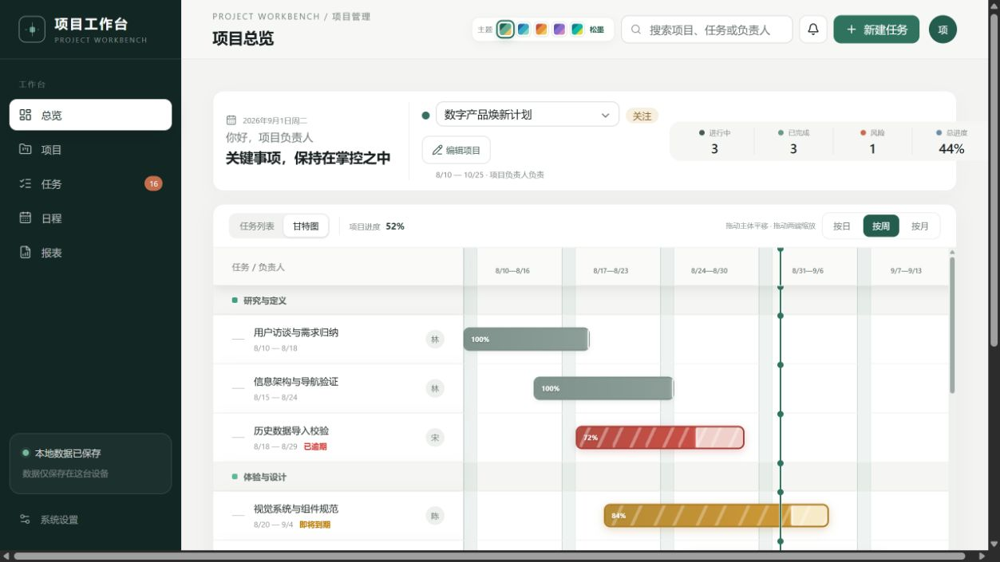
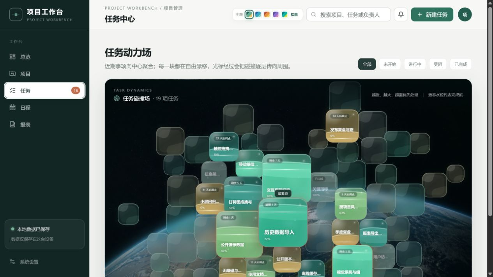
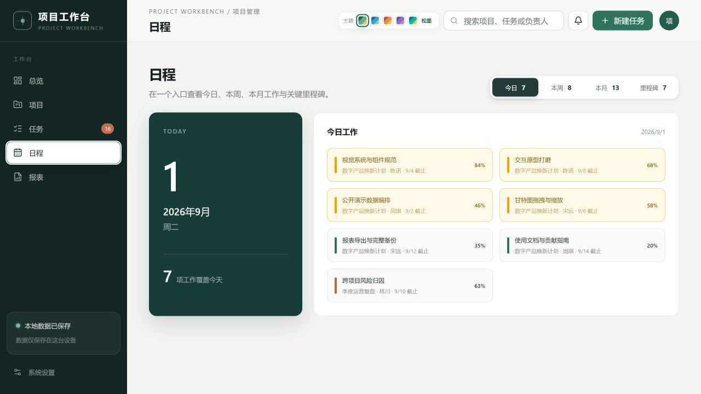

# 功能与特色

项目工作台面向需要长期推进、不断调整并持续留下工作记录的项目。它不是单纯的待办清单，而是把计划、执行、更新和复盘连成一条完整链路。

## 项目与任务结构

- 一个项目可以建立多个子项目。
- 项目支持改名和修改描述。
- 任务可以继续拆分为子任务。
- 每项任务可设置负责人、优先级、完成度、开始日期和结束日期。
- 可以直接延期若干天，也可以精确修改起止日期。

## 可操作甘特图

- 在首页默认展示选定项目的甘特图。
- 支持按日、周、月查看。
- 拖动任务条主体可整体移动排期。
- 拖动左右端点可扩展或缩短周期。
- 时间轴在纵向滚动时保持可见。
- 周一整列使用浅色背景，方便按周规划。
- 完成、进行中、未开始、即将到期与已经逾期使用一致而清晰的状态色系。
- 进行中任务在同一色块内区分已完成和未完成部分。

## 任务动力场

- 越紧迫的任务越大并尽量靠近中心。
- 任务方块在限定范围内缓慢移动，不形成整齐僵硬的队列。
- 光标接近时触发放大和逐层衰减的碰撞反馈。
- 方块允许边缘叠放，但避免文字区域互相遮挡。
- 光标静止时，附近方块不会持续抖动。
- 液态水位表达完成度；已完成任务保持克制的低饱和状态。
- 停留满一秒才显示浅色信息卡，避免频繁弹窗打断查看。

## 日程与今日工作

- 今日：集中显示覆盖当天的工作。
- 本周：查看近期需要协调的任务。
- 本月：观察更长周期的工作密度。
- 里程碑：单独查看关键交付节点。
- 每条日程同时展示项目、负责人、截止时间与完成度。

## 工作记录

任务状态变化不覆盖历史过程。每项任务可以持续追加：

- 进展：已经完成了什么；
- 问题：遇到了什么阻碍；
- 优化：做了哪些改进；
- 决策：为什么改变原计划。

这让工具同时承担计划表和工作档案的角色。

## 主题与视觉

顶部提供五套全局主题：松墨、潮汐、日晷、鸢尾和信号。切换的不只是颜色，还包括甘特图高度、条纹材质、动画速度和界面节奏。

## 报表与数据掌控

- 导出 CSV 任务报表，用于表格分析和汇报。
- 导出 JSON 完整备份，用于迁移与恢复。
- 默认不要求账号，不连接业务服务器，不上传项目内容。

当前测试版仍使用浏览器/WebView 本地空间。重要数据必须定期导出 JSON 备份。
